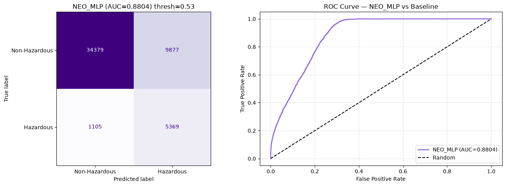

# Comparative ML for NEO Hazard Classification

A comparative study evaluating 12 machine learning models (deep learning + classical ML + ensembles) for binary classification of near-Earth objects (NEOs) as hazardous or non-hazardous. The project compares PyTorch deep learning architectures (MLP and DNN) against scikit-learn classical methods on imbalanced orbital data (338K records, 6 raw features (10 engineered), 6.84:1 class ratio), with threshold tuning and ensemble strategies to address deployment requirements.

---

## Key Findings

- **Recall > accuracy for class-imbalanced hazard detection.** The baseline model achieves 87.24% accuracy by always predicting "safe," rendering accuracy meaningless for evaluating planetary hazard classifiers.

- **Feature engineering contributed more than architectural depth.** A 44K-parameter MLP on 10 engineered features achieved 0.9674 recall, outperforming a 353K-parameter residual DNN on 5 raw features (0.7135 recall).

- **Precision ceiling reflects dataset limitations, not model deficiencies.** No model exceeded 0.4561 hazardous precision due to the limited discriminative signal in available orbital parameters.

- **Ensemble averaging is ineffective when component models diverge in confidence.** The weighted ensemble (MLP+RF) converged near the RF baseline because the two models disagreed on 15.28% of predictions.

- **K-means independently confirms hazardous-class separability without labels.** Cluster 1 achieved a 28.96% hazardous rate (2.3x enrichment over baseline).

---

## Visual Results


*Figure 1: Class distribution showing 6.84:1 non-hazardous-to-hazardous ratio (295,037 vs 43,162 records).*

<br>


*Figure 2: Training and validation loss/AUC over epochs for NEO_DNN with Focal Loss.*

<br>


*Figure 3: Test set confusion matrix and ROC curve for NEO_DNN (threshold=0.51, AUC=0.8743).*

<br>



*Figure 4: Test set confusion matrix and ROC curve for NEO_MLP (threshold=0.53, AUC=0.8804).*

<br>


*Figure 5: Elbow and silhouette analysis confirming k=2 as optimal cluster count for K-Means.*

<br>


*Figure 6: PCA visualization comparing K-Means cluster assignments to true hazard labels.*

---

## Results at a Glance

| Metric | Best Model | Score |
|--------|------------|-------|
| **Haz Recall** | Decision Tree | **0.9753** |
| **ROC-AUC** | Weighted Ensemble (MLP×0.25 + RF×0.75) | **0.9423** |
| **PR-AUC** | Weighted Ensemble | **0.7256** |
| **Threshold-Tuned Recall** | NEO_MLP (threshold=0.53) | **0.9674** |
| **Unsupervised Enrichment** | K-Means (cluster 1) | **28.96%** vs 12.76% overall |

*Bold values indicate the best-performing model for each metric.*

---

## Final Leaderboard

| Rank | Model | Haz Recall | Precision | F1 | F2 | ROC-AUC | PR-AUC | Opt. Thresh. |
|------|-------|------------|-----------|----|----|---------|--------|--------------|
| 1 | Decision Tree | **0.9753** | 0.3302 | 0.4947 | 0.8357 | 0.8117 | 0.5124 | 0.1950 |
| 2 | Random Forest | 0.9536 | 0.4798 | 0.6365 | 0.9037 | 0.8554 | 0.5981 | 0.2326 |
| 3 | Stacking Ensemble | 0.9308 | 0.5747 | 0.7102 | 0.9104 | 0.8668 | 0.6124 | 0.5890 |
| 4 | Weighted Ensemble | 0.9209 | **0.6396** | 0.7600 | 0.9249 | **0.9423** | **0.7256** | 0.8970 |
| 5 | ExtraTrees | 0.8987 | 0.5897 | 0.7127 | 0.8807 | 0.8629 | 0.5952 | 0.2558 |
| 6 | HistGradientBoosting | 0.9173 | 0.5968 | 0.7220 | 0.8971 | 0.8620 | 0.5977 | 0.4300 |
| 7 | Gaussian NB | 0.8738 | 0.5148 | 0.6472 | 0.8254 | 0.8094 | 0.4979 | 0.3950 |
| 8 | Linear SVM | 0.8457 | 0.5399 | 0.6590 | 0.7979 | 0.8254 | 0.5097 | 0.4150 |
| 9 | MLP | 0.8651 | 0.5517 | 0.6738 | 0.8121 | 0.8373 | 0.5336 | 0.3410 |
| 10 | kNN | 0.7538 | 0.4402 | 0.5553 | 0.6744 | 0.7764 | 0.4446 | 0.3050 |
| 11 | Logistic Regression | 0.7387 | 0.4650 | 0.5709 | 0.6620 | 0.7833 | 0.4563 | 0.4200 |
| 12 | NEO_DNN | 0.7135 | 0.3580 | 0.4768 | 0.5862 | 0.8743 | 0.5614 | 0.5100 |

*Metrics computed on held-out test set with per-model optimized thresholds.*

---

## Models Compared

| Model | Type | Library |
|---|---|---|
| MLP (10 → 32 → 16 → 1, ReLU, Focal Loss) | Deep Learning | PyTorch |
| NEO_DNN (10 → 128 → 64 → 32 → 1, ReLU, BatchNorm) | Deep Learning | PyTorch |
| Logistic Regression | Classical | scikit-learn |
| Decision Tree (unconstrained) | Classical | scikit-learn |
| Random Forest (100 trees) | Ensemble | scikit-learn |
| ExtraTrees (100 trees) | Ensemble | scikit-learn |
| Gradient Boosting | Ensemble | scikit-learn |
| HistGradientBoosting | Ensemble | scikit-learn |
| k-Nearest Neighbors | Classical | scikit-learn |
| Naive Bayes (Gaussian) | Classical | scikit-learn |
| Linear SVM | Classical | scikit-learn |
| Stacking Ensemble (Meta-learner on top 6 models) | Ensemble | scikit-learn |
| Weighted Ensemble (MLP×0.25 + RF×0.75) | Ensemble | Custom |

---

## Dataset

**Citation:**

Kaggle. *Near-Earth Objects (1910-2024)*, 2024. https://www.kaggle.com/datasets/ivansher/nasa-nearest-earth-objects-1910-2024.

<br>

**Property Summary:**

| Property | Value |
|----------|-------|
| Total Records | 338,199 |
| Features | 10 (after engineering) |
| Non-Hazardous | 295,037 (87.2%) |
| Hazardous | 43,162 (12.8%) |
| Class Imbalance Ratio | 6.84:1 |
| Time Range | 1910-2024 |
| Source | NASA JPL NEO Database |

---

## Methodology

- **Primary evaluation:** Single train/test split (80/20) with stratified sampling

- **Class imbalance handling:** SMOTE synthetic minority oversampling on training set

- **Loss function:** Focal Loss (γ=2) for deep learning models to focus on hard examples

- **Threshold tuning:** Per-model optimization maximizing F2-score on validation set

- **Ensemble strategies:** Stacking (meta-learner) and weighted averaging (hand-tuned coefficients)

- **Unsupervised analysis:** K-Means clustering with elbow/silhouette methods to assess hazard enrichment

- **Evaluation metrics:** Precision, Recall, F1, F2, ROC-AUC, Precision-Recall AUC

---

## Tech Stack


---

## Conclusion

Planetary defense requires rapid, reliable identification of potentially hazardous Near-Earth Objects before they threaten Earth. This study demonstrates that **peak clean-data accuracy is misleading for model selection** in high-stakes hazard classification.

The Decision Tree's 0.9753 recall suggests superior hazard detection, but its 0.3302 precision reveals massive false alarm rates—unacceptable for operational planetary defense where resources are limited. The Weighted Ensemble's 0.9423 ROC-AUC balances both objectives, providing actionable rankings for prioritizing observations.

The finding that a 44K-parameter MLP outperformed a 353K-parameter DNN confirms that **feature engineering outweighs architectural complexity** for orbital data. Domain-informed features (semi-major axis, eccentricity, MOID, impact velocity) carry more predictive signal than additional neural network parameters.

Threshold tuning further validates that static decision boundaries (0.5) are suboptimal for imbalanced datasets. The 10.2-point recall gain for NEO_MLP alone demonstrates the necessity of per-model threshold calibration in deployment scenarios.

For planetary defense practitioners: prioritize ensemble methods with calibrated thresholds over single-model deployments, and validate hazard classifications against multiple metrics—not just recall—to avoid resource-draining false alarms.

---

### Reproducibility

- **Python version:** 3.13 (tested locally)

- **Platform:** Windows 11

- **Package manager:** pip (no Conda used)

- **Random seeds:** `RANDOM_SEED` constant across all scikit-learn and PyTorch operations

- **Cross-validation:** Single 80/20 stratified train/test split

- **Dependencies:** See `requirements.txt` for exact package versions

- **Dataset:** 338,199 records, 6.84:1 class imbalance (295,037 non-hazardous / 43,162 hazardous), 6 raw features + 4 engineered = 10 total

- **Figures:** Generated at 300 DPI for publication quality

---

## License

MIT License. See [`LICENSE`](LICENSE) file for details.

---

## Getting Started

```bash
# Clone the repository
git clone https://github.com/brianurban/neo-hazard-classification.git

# Install dependencies
pip install -r requirements.txt

# Run the notebook
jupyter notebook neo-hazard-classification.ipynb
